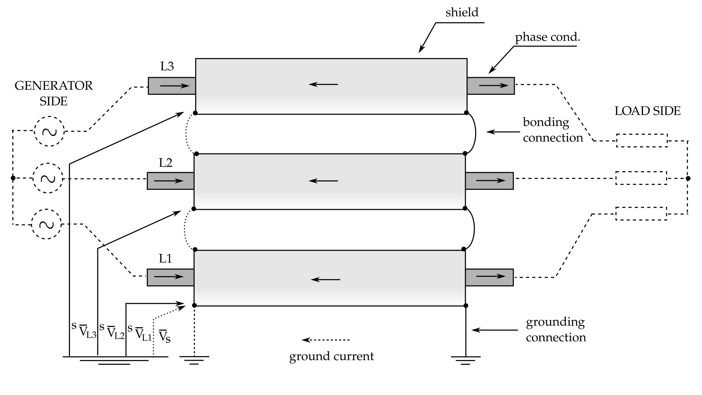

# Generator's high-current bus ducts

Computation of current distributions, power losses, and magnetic fields of the high-current, shielded generator bus ducts.

High-current air-insulated bus duct systems are often used in power generation facilities as power transmission lines. Their main area of application could be seen as a connection between the generator unit and its step-up (unit) transformer. Due to the medium voltage level of the generator terminals (10–30 kV) and very high-current output (usually 5–10 kA), generator connection to the step-up transformer is often carried out with the so-called high-current bus duct system. This system is seen as an efficient way of evacuating power from the generator units, especially in the case of, e.g., hydro power plants, where generator units are housed in a cavern.

Design of the bus system can vary somewhat, due to the manufacturer design, but it usually consists of aluminum or copper conductors encapsulated in the aluminum enclosure (shield). Each phase conductor can have its own separated metal enclosure, mutually short-circuited at the ends of the bus duct. This is known as the single-phase enclosure bus duct design (see figure above). The source code provided here can be used for the computation of the current distribution in phase conductors and shields (proximity and skin effects are accounted for), computation of power losses, and magnetic field distributions around the bus duct system.

**References**
P. Sarajcev, Analysis of Electromagnetic Influences Concerning Two Adjacent Parallel High-current Bus Ducts, Electric Power Components and Systems, 40:8, 2012, pp. 829-844, http://dx.doi.org/10.1080/15325008.2012.666614